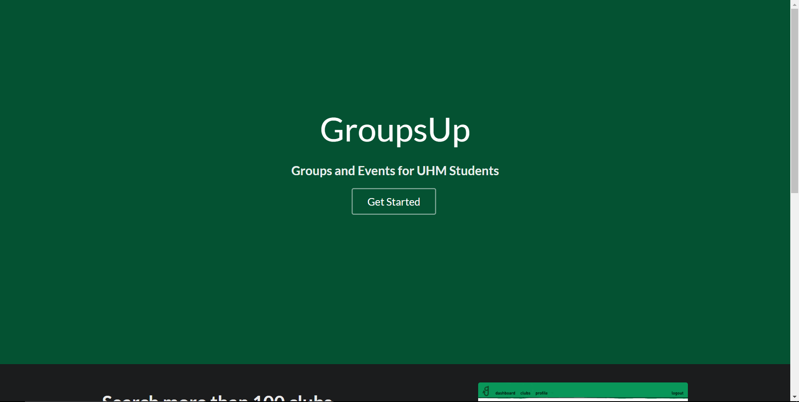

## Welcome to GroupsUP

<a href="http://groupsup.meteorapp.com/"><i class="large github icon"></i>GroupsUp Meteor App</a>

# Table of contents

* [Overview: GroupsUp](#overview-of-groupsup)
* [User Guide](#user-guide)
  * [Login](#login)
  * [Profile](#profile)
  * [Find Groups](#find-groups)
* [Dev Guide](#dev-guide)
  * [Installation](#installation)
  * [Running](#running-groupsup)
* [Application Design](#application-design)
  * [Data Model](#data-model)
* [Development History](#development-history)
  * [Milestone 1](#milestone-1)
  * [Milestone 2](#milestone-2)
  * [Going Forward](#milestone-3)
* [Community Feedback](#community-feedback)  

## Overview of GroupsUp

GroupsUp is an meteor app designed to promote student activity and the growth of clubs of University of Hawaii. Students can find clubs and club events based on interests. Club leaders can use it to promote events in a way that is simple for students to find, and let them know how to get involved! 

## User Guide

### Login
For this application you must have an account in the UH Cas-Login system. If you are a part of that system then you're already set! simply click "Get Started" on the homepage and login with your UH account.



### Profile
Under the 'Profile' tab go ahead an hit edit to updat your personal information. Don't forget to let us know what you're interested in so we can help you find groups with similar interests!


### Find Groups


## Dev Guide

### Installation

1. [Install Meteor](https://www.meteor.com/install).
2. [Download a copy of GroupsUp](https://github.com/groupsup/groupsup/archive/master.zip), or clone it using git.
3. Change directory into app/ and install libraries with:

```
$ meteor npm install
```

4. Check to make sure the package.json file contains:
```
{
  "name": "groupsup",
  "private": true,
  "scripts": {
    "start": "meteor --no-release-check --settings ../config/settings.development.json",
    "lint": "eslint ./imports",
    "jsdoc": "./node_modules/.bin/jsdoc -c ./jsdoc.json -r .",
    "test": "cross-env TEST_WATCH=1 meteor test --driver-package meteortesting:mocha"
  },
  "dependencies": {
    "autoprefixer": "^6.7.7",
    "babel-runtime": "^6.26.0",
    "meteor-node-stubs": "~0.2.0",
    "simpl-schema": "^0.3.2"
  },
  "devDependencies": {
    "autoprefixer": "^6.3.1",
    "chai": "*",
    "cross-env": "^5.1.1",
    "docdash": "^0.3.0",
    "es6-enum": "^1.0.3",
    "eslint": "^3.19.0",
    "eslint-config-airbnb": "^15.0.1",
    "eslint-plugin-import": "^2.3.0",
    "eslint-plugin-jsx-a11y": "^5.0.3",
    "eslint-plugin-meteor": "^4.1.0",
    "eslint-plugin-react": "^7.0.1",
    "jsdoc": "^3.4.0",
    "jsdoc-to-markdown": "^2.0.0"
  },
  "postcss": {
    "plugins": {
      "autoprefixer": {
        "browsers": [
          "last 2 versions"
        ]
      }
    }
  }
}
```
### Running GroupsUp

And run the command:

```
$ meteor npm run start
```

If successful, the application will appear at [http://localhost:3000](http://localhost:3000).

5. Make sure you have an account on the UH test CAS server or else you will be unable to login with your UH username and password.

### Application Design

### Data Model

This basis on what the entire project is built on are three main JavaScript objects named: InterestCollection, ProfileCollection, and GroupCollection. To simplify implementation, [SimpleSchema](https://github.com/aldeed/meteor-simple-schema) was used. 

To even further simplify implementation, the ProfileCollection and InterestCollection classes inherit from the BaseCollection class.

## Milestone 1

Development began with the mockup of the main pages users will be encountering the most.

The dashboard displays upcomming events for the clubs you the user belong to and any notifications from the specific clubs themselves. 


Each club will have their own landing page where you can view information like meeting times, location, and events they are hosting.


Each user will have their own profile page where it displays their name, major, campus, interests and a small blurb about who they are.


If you are looking for new clubs to join, use the browse feature where you can filter clubs based on interests in order to find exactly what you're looking for.


Also during this time, thought was being put into how the data model was going to be designed.

## Milestone 2

Our main hurdle and goal was implementing the database. We designed it with our core ideas for the application in mind; we have users, groups, and interests. These cornerstones of the application would also become the foundations of our database.

Group collection:
```
class GroupCollection extends BaseCollection {
	constructor() {
		super('Group', new SimpleSchema ({
			name: { type: String },
			interest_id: [Number],
      meeting_info: String,
      admin: String,
      group_image: String,
      image_one: String,
      image_two: String,
      image_three: String,

		}, { tracker: Tracker }));
	}
```

Profile collection:
```
class ProfileCollection extends BaseCollection {
  constructor() {
    super('Profile', new SimpleSchema({
      username: { type: String },
      // Remainder are optional
      first_name: { type: String, optional: true },
      last_name: { type: String, optional: true },
      bio: { type: String, optional: true },
      interests: { type: Array, optional: true },
      'interests.$': { type: String }, 
      image: { type: SimpleSchema.RegEx.Url, optional: true },
      groups_id: { type: Array, optional: true },
      'groups_id.$': { type: Number }
    }, { tracker: Tracker }));
  }
```

As we continued development we saw more pages that were needed and finished off some that were required for our main structure. Then with both the database complete we took to connecting pages to access it.

User profile page:


Group page:


## Community Feedback

Our test base's main concern was available content, as they were using it mainly in a time in which the database was not connected to anything. The user's really enjoyed the aesthetic design as well as functional design saying it felt "familiar." They did manage to help us in nailing down a few bugs with routing as there was an issue with the routing adding a space to some usernames. We, the GroupsUp team, appreciate all of the feedback we recieved from our testers and are working to improve our application.


